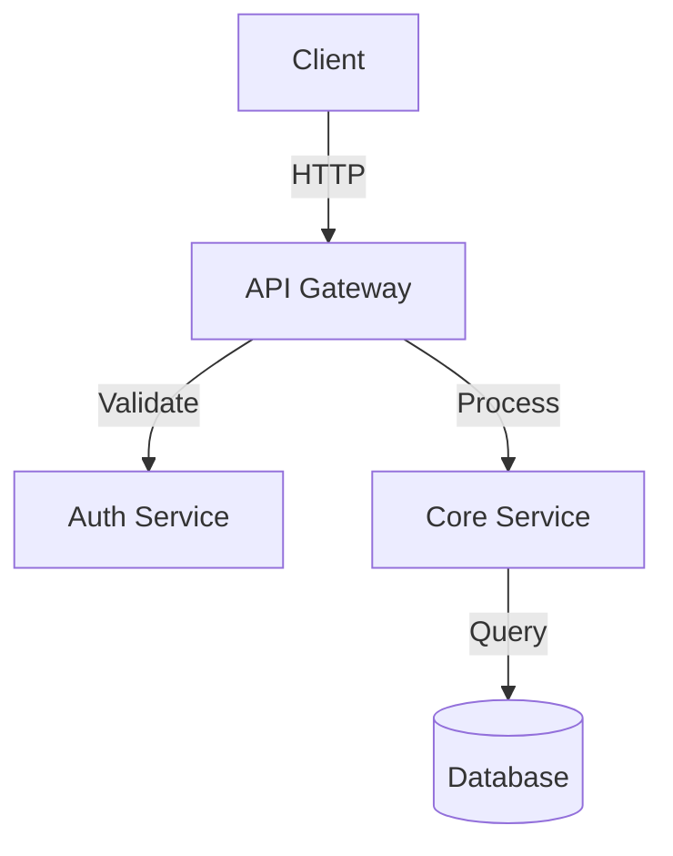

# /architecture-gen

## Overview
Generate comprehensive system architecture diagrams, documentation, and Architecture Decision Records (ADRs) directly from your codebase. Analyzes code structure, dependencies, and patterns to produce visualizations and documentation.

## Usage

```bash
/architecture-gen
```

## Features

- **Architecture Diagrams**: Generate system architecture diagrams (Mermaid, PlantUML)
- **Dependency Graph**: Visualize module and package dependencies
- **Architecture Decision Records (ADRs)**: Document architectural decisions
- **Component Inventory**: Catalog of all system components with responsibilities
- **Data Flow Diagrams**: Visualize data movement through the system
- **Integration Points**: Document external service integrations
- **Layer Analysis**: Identify and document architectural layers

## Configuration

```yaml
architecture:
  format: "mermaid" # mermaid, plantuml, svg
  depth: "full" # full, services, modules
  includeDataflow: true
  generateADRs: true
  outputDir: "./docs/architecture"
```

## Example Output



## Options

- `--depth`: Diagram depth (full, services, modules)
- `--format`: Output format (mermaid, plantuml)
- `--with-dataflow`: Include data flow diagrams
- `--with-adrs`: Generate ADRs for decisions
- `--output`: Custom output directory

## See Also

- `/dev-code-review` - Code quality analysis
- `/full-review` - Complete codebase audit
- `/perf-trace` - Performance profiling
